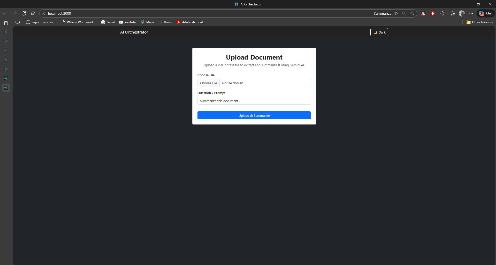
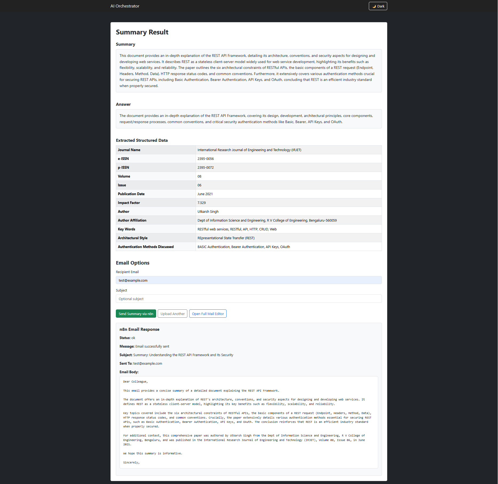
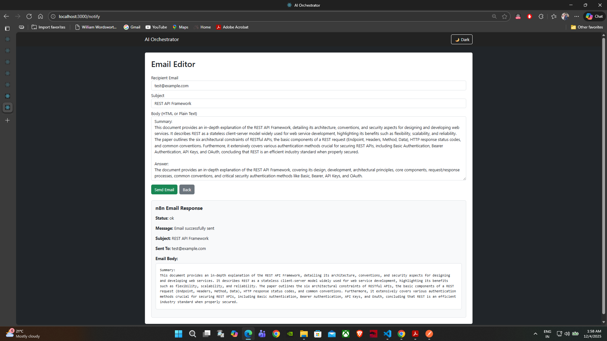
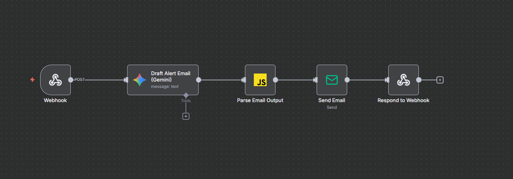

# 🚀 AI Document Orchestrator  
_Transform PDFs & text files into summaries, structured data, and professional emails using AI._

<p align="center">
  
  
  
  
  
  
  
</p>

A full-stack AI automation system for businesses that want to extract insights from documents and automatically draft professional emails with **Gemini AI**, **Node.js**, **React**, and **n8n**.

---

# 🌐 Live Demo

| Component | Link |
|----------|------|
| **Frontend (Vercel)** | https://ai-orchestrator-frontend.vercel.app |
| **Backend API (Render)** | https://ai-orchestrator-backend-f0k6.onrender.com |

---

# ✨ Key Features

## 📥 1. Document Upload & AI Summaries  
- Upload **PDF or TXT** files  
- Gemini AI generates:  
  ✔ Clean summary  
  ✔ Detailed answer  
  ✔ Natural-language explanation  

---

## 🧠 2. Structured Data Extraction  
Automatically extracts:  
- Employee details  
- Reference IDs  
- Dates  
- Organizations  
- Academic details  
- Invoice values  
- And more (dynamic extraction)

---

## ✉️ 3. Smart Email Drafting (User-Aware Logic)  
The system follows strict logic:

| User Input | System Behavior |
|------------|-----------------|
| Custom Subject | Used **exactly as is** |
| Custom Body | Used **exactly as is** |
| Subject empty | AI generates a professional subject |
| Body empty | AI drafts polished, natural email |
| Always | Email field untouched |

✔ ZERO rewriting of user text  
✔ Fallback only when fields are empty  

---

## 📤 4. Email Delivery (SMTP)  
- Real-time preview in UI  
- n8n workflow automates sending  
- Clear success/error response to frontend  

---

## 🤖 5. n8n Workflow Automation  
A full automation pipeline:


PNG diagram included in screenshots section.

---

# 🧩 Tech Stack

### **Frontend**
- React.js  
- TailwindCSS  
- Axios  
- React Router  
- Vercel Hosting  

### **Backend**
- Node.js  
- Express.js  
- Gemini API  
- pdf-parse  
- Multer  
- Render Hosting  

### **Automation**
- n8n Cloud Workflow  
- Webhooks  
- SMTP  

---

# 🏗️ System Architecture Diagram

```plaintext
                  ┌───────────────────────────┐
                  │        FRONTEND (React)    │
                  │ Upload Doc | Email Editor  │
                  └───────────────┬───────────┘
                                  │
                                  ▼
                  ┌───────────────────────────┐
                  │   BACKEND (Node + Express)│
                  │ PDF Parsing | Gemini Calls │
                  │ Sends Data → n8n Webhook  │
                  └───────────────┬───────────┘
                                  │
                                  ▼
                  ┌───────────────────────────┐
                  │        n8n Workflow        │
                  │ AI Draft → JS Parse → SMTP│
                  └───────────────┬───────────┘
                                  │
                                  ▼
                  ┌───────────────────────────┐
                  │        Email Recipient     │
                  └───────────────────────────┘

---

# 📸 Screenshots

> **Note:** Add PNG files in `/screenshots` folder with the same names.

### 📤 **Document Upload Screen**  


---

### 📊 **Summary + Structured Data**  


---

### ✉️ **Email Editor + AI Response**  


---

### 🤖 **n8n Workflow Diagram**  


---

# ⚙️ Installation

## 🔽 Clone Repositories

### Frontend:


```bash
git clone https://github.com/aditya32193213/ai-orchestrator-frontend.git
cd ai-orchestrator-frontend
npm install
npm start

